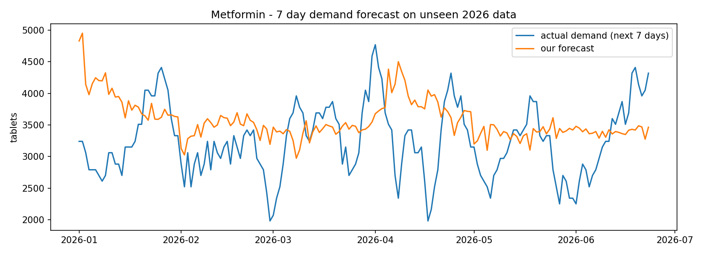

# rx-refill-predictor

A pharmacy machine-learning project built end to end, one file at a time.

Seventeen numbered scripts take synthetic pharmacy data from raw CSVs, through
feature engineering, models, experiment tracking, monitoring and a REST API in a
container. Every script prints what it found and says whether the result was
good or bad.

**The data is synthetic.** Real dispensing records are protected health
information. `01_generate_data.py` makes all of it. Only the *shapes* of the
fields come from a real pharmacy system — NDC-11, NPI, DEA, DAW, BIN/PCN are
public NCPDP and FDA standards. No production data was used.

---

## The two questions this answers

**Model A — refill risk.** A pharmacy gives out a 30 day supply. A patient
taking their medicine properly comes back in about 30 days. A patient who comes
back after 60 days spent a month with no medicine. The pharmacy wants to phone
those people *before* it happens, but it cannot phone three thousand patients.
So: **for each pickup, on the day the medicine runs out, will this patient come
back within 14 days?**

- `1` = came back in time
- `0` = came back late, or never came back

Never coming back counts as `0`, not as missing. Those are the patients that
matter most.

**Model B — demand forecast.** A different shape of problem on the same data:
predict a *number*, not a yes/no. **For each drug, how many units will we hand
out over the next 7 days?** So the owner knows how much to order.

---

## The data

| File | Rows | What it holds |
|---|---:|---|
| `data/drugs.csv` | 12 | NDC, strength, form, DEA class, AWP, pack size |
| `data/insurances.csv` | 6 | BIN/PCN, brand and generic copay, cash flag |
| `data/prescribers.csv` | 60 | NPI, DEA number, specialty |
| `data/patients.csv` | 3,000 | date of birth, gender, address, language, insurance |
| `data/prescriptions.csv` | 14,218 | Rx header — drug, quantity, days, refills allowed |
| `data/fills.csv` | 87,112 | one row per pickup — the fact table |

**How the signal was planted.** Each patient gets a hidden `adherence` score
between 0 and 1 that decides how long they wait before coming back. That score
is **never written to any file**. The model has to find it again from the dates
alone. That is what makes it possible to check the pipeline actually works — if
`pct_late` did not come out as the strongest feature, something would be broken.

**Drugs are assigned by medical condition, not at random.** A patient is given a
condition first (diabetes, high blood pressure, high cholesterol, thyroid, acid
reflux, nerve pain, asthma, depression) and then the drugs that go with it, plus
companion drugs at realistic rates — a diabetic gets Metformin, and Lisinopril
55% of the time, because kidney protection is standard care. This matters for
one file only, `15_recommend.py`, and the reason is written up below.

Prescriptions renew when the refills run out, producing a new Rx number and
resetting the refill counter, the same as a real pharmacy. Checked: no row has
`refill_num > refills_authorized`.

Some things the data will tell you if you look (`02_explore.py`):

- Average gap between pickups: **58.9 days**, median 46, on 30 and 90 day supplies
- **3.1%** of patients are never late; **36.6%** are late more than half the time
- Average copay: Medicaid $0.08, Medicare Part D $1.75, CVS Caremark $11.58, **cash $59.07**

That last row is the whole argument for insurance in one line.

---

## Model A — results

Test set is every pickup running out in 2026. Training set is everything before
it. 84,030 rows total — 74,508 train, 9,522 test.

| Model | Accuracy | ROC-AUC |
|---|---:|---:|
| Always guess "will come back" | 0.547 | — |
| Logistic Regression | 0.643 | 0.710 |
| XGBoost, settings guessed | 0.660 | 0.711 |
| **XGBoost, settings tuned** | **0.666** | **0.716** |

`07_cross_validate.py` splits the training data five ways in time order and
scores each fold: `0.629, 0.682, 0.684, 0.704, 0.713` — mean 0.682, **standard
deviation 0.029**.

That number is the most useful one in the project. It says the natural wobble in
this data is about ±0.029. So logistic 0.710 and XGBoost 0.716 are **the same
score**. The 0.006 gap is smaller than the noise.

`08_tune_model.py` searches 12 combinations of settings and finds
`learning_rate=0.03, max_depth=3, n_estimators=200` — a *small* tree, 3 levels
deep. Tuning is done on cross-validation only; the test set is opened once, at
the end, and never used to pick anything.

**Why the ceiling is low, and why that is fine.** `pct_late` — how often this
patient has been late before — carries most of the signal, and its relationship
to the outcome is close to a straight line. A straight line already captures it,
so trees have nothing left to add. Getting past 0.72 needs *more information*
(copay, auto-refill enrolment, distance to the pharmacy, how many medicines they
are on), not a bigger model.

### Where it gets things wrong

At the 0.5 cut-off, XGBoost tuned:

|  | Predicted: won't come back | Predicted: will come back |
|---|---:|---:|
| **Actually didn't come back** | 2,562 | 1,749 |
| **Actually came back** | 1,434 | 3,777 |

On the at-risk patients: precision 0.641, recall 0.594.

### The cut-off is a business decision, not a model decision

0.5 is a choice. Moving it changes the whole operation:

| Cut-off | Calls made | At-risk caught | At-risk missed | Wasted calls |
|---:|---:|---:|---:|---:|
| 0.4 | 1,126 | 830 | 3,481 | 296 |
| 0.5 | 2,576 | 1,746 | 2,565 | 830 |
| 0.6 | 4,305 | 2,689 | 1,622 | 1,616 |
| 0.7 | 6,269 | 3,500 | 811 | 2,769 |
| 0.8 | 8,105 | 4,063 | 248 | 4,042 |

At 0.8 the pharmacy catches 94% of at-risk patients but half its calls are
wasted. At 0.5 it makes a third of the calls and catches 40%. Which is right
depends on how many people can make calls and what a missed refill costs —
nothing in the model can answer that.

### Why the model said so

`09_explain_model.py` uses SHAP, which takes one prediction apart and shows how
much each feature pushed it up or down from a starting point.

| Feature | Average push |
|---|---:|
| `pct_late` | 0.589 |
| `fill_number` | 0.220 |
| `avg_gap` | 0.033 |

In healthcare "the model said so" is not an answer anyone accepts. *"This
patient has been late on 8 of their last 10 refills"* is one a pharmacist can
check and argue with.

---

## Model B — demand forecast

Pickups are first collapsed to one row per drug per day on a **complete
calendar** — a day with no dispensing becomes a real `0`, not a missing row.
Features are the totals from 1, 7, 14 and 28 days ago, plus 7 and 28 day rolling
averages, all shifted so today never sees itself, plus day of week and month.

Average real 7-day demand is **1,337 units**.

| Model | MAE (units) | MAPE |
|---|---:|---:|
| "next week = last week" | 279 | 23.4% |
| **XGBoost regressor** | **236** | **21.0%** |



Blue is real, orange is the forecast, on 2026 data the model never saw. It
tracks the level and deliberately does not chase the spikes — the day each
patient walks in is random by construction, so a model that matched every spike
would be memorising, not learning.

---

## Four times the simple thing won

This is the finding I would actually talk about in an interview.

| Comparison | Simple | Fancy | Winner |
|---|---|---|---|
| Refill risk (file 05) | Logistic 0.710 | XGBoost 0.716 | tie — inside ±0.029 noise |
| Finding drug diversion (files 13, 14) | Isolation Forest **13/20** | Autoencoder **6/20** | simple, clearly |
| Demand forecast (file 16) | XGBoost MAE **223** | LSTM MAE **242** | simple |
| Refill risk from a sequence (file 17) | XGBoost 0.685 | LSTM 0.681 | tie |

None of that means neural networks are bad. It means **six columns of tabular
data is not what a neural network is for**. An LSTM earns its keep on long
sequences with real order in them — speech, sensor traces, language. Twenty-eight
days of one number is not long enough for it to beat a gradient-boosted tree
that gets the same twenty-eight numbers as plain columns.

Building both and reporting the honest result is the point. Building only the
LSTM and calling it "deep learning for pharmacy" would have been easier and
worth less.

---

## Catching drug diversion

`01b_plant_diversion.py` plants 20 fake diverters into a copy of the data —
patients who pick up a controlled drug every 8 to 16 days on a 30 day supply.
It writes the answer key to `data/known_diverters.csv`. Nothing downstream is
allowed to see that file until it is time to score.

296 patients are on the controlled drug. Both detectors get the same six
features: number of pickups, average gap, shortest gap, share of early pickups,
average days early, total quantity.

**Isolation Forest** (`13_find_unusual.py`) — the idea is that odd points are
easy to cut off from the rest, so it counts how few random cuts it takes to
isolate each patient.

| Review budget | Flagged | Caught (of 20) | False alarms |
|---:|---:|---:|---:|
| 1% | 3 | 3 | 0 |
| 2% | 6 | 6 | 0 |
| 3% | 9 | 8 | 1 |
| 5% | 15 | 13 | 2 |
| 8% | 24 | 19 | 5 |

**Autoencoder** (`14_autoencoder_anomaly.py`) — a small neural network,
6 → 4 → 2 → 4 → 6, trained to squeeze each patient down to two numbers and
rebuild them. `model.fit(X, X)` — the input is also the answer. Patients it
rebuilds badly are the ones that do not look like everyone else.

| Review budget | Flagged | Caught (of 20) | False alarms |
|---:|---:|---:|---:|
| 1% | 2 | 1 | 1 |
| 3% | 8 | 4 | 4 |
| 5% | 14 | 6 | 8 |
| 8% | 23 | 6 | 17 |

At a 5% review budget: **13 caught vs 6**. Same features, same patients, same
scoring. Contamination is framed as a *review budget* on purpose — it is the
same kind of decision as the phone-call cut-off above.

---

## Patient segments

`12_patient_segments.py` — no labels here. K-Means groups patients by how they
behave, then the groups get read afterwards to see what they mean. Silhouette
score picked k=4 over inertia, because inertia always improves with more groups
and never tells you when to stop.

| Group | Patients | Late rate | Pickups | Drugs | Avg copay |
|---|---:|---:|---:|---:|---:|
| 0 | 782 | 0.34 | 52 | 2.6 | $6.33 |
| 1 | 1,158 | 0.62 | 22 | 1.4 | $4.82 |
| 2 | 1,032 | 0.26 | 19 | 1.2 | $4.54 |
| **3** | **10** | 0.41 | 48 | 2.8 | **$450** |

Group 3 is ten people paying $450 a visit while everyone else pays under $7.
Nobody asked for that group. It fell out of the data. Those are cash patients on
brand-name drugs, and they are exactly who a pharmacy would want to know about —
both because they are at risk of walking away, and because a generic switch
would change their life.

---

## Monitoring — and a false alarm worth keeping

`11_monitor_drift.py` compares this month's feature distributions against the
training data using PSI (population stability index). Above 0.2 usually means
"go look".

| Feature | PSI |
|---|---:|
| `fill_number` | **6.387** |
| `pct_late` | 0.389 |
| `avg_gap` | 0.378 |
| `prev_gap` | 0.033 |
| `patient_age` | 0.021 |

`fill_number` screams. It is also completely fine: it counts how many times a
patient has picked up this drug, so it climbs forever as time passes. It is
listed in `DRIFTS_BY_DESIGN` and excluded from alerting.

That distinction — a number that moves *by construction* versus a number that
moves *because the world changed* — is the whole job of drift monitoring. A
monitor that pages someone at 3am for `fill_number` gets switched off within a
week, and then nobody notices the real drift either.

---

## Recommending drugs

`15_recommend.py` — no model, no training, no neural network. Just counting.

For every pair of drugs, count how many patients on drug A are also on drug B.
Then divide by how common drug B is overall. That ratio is called **lift**:

```
lift = (share of A patients who also take B) / (share of everyone who takes B)
```

Lift of 1 means B is no more common among A patients than anywhere else — no
connection. Lift of 4 means four times more likely.

| If patient takes | Also takes | Share | Baseline | Lift |
|---|---|---:|---:|---:|
| Insulin Glargine | Metformin | 1.00 | 0.229 | **4.37** |
| Lisinopril | Insulin Glargine | — | — | 2.21 |
| Lisinopril | Metformin | 0.494 | 0.229 | 2.16 |

Insulin and Metformin are both diabetes drugs, so every insulin patient is on
Metformin. Lisinopril shows up next to both because it protects the kidneys in
diabetes. The recommender rediscovered diabetes care from pickup records alone.

**This only worked after fixing the data.** The first version assigned drugs to
patients at random, so every pair came out at 13–14% and every lift was 1.0.
The recommender was right — there was genuinely nothing there. That is why
`01_generate_data.py` now assigns by condition. A recommender on random data is
a recommender that cannot work, and no amount of algorithm would have saved it.

---

## The three ways this project could have quietly lied

Every one of these produces a model that scores beautifully and is worthless.

**1. Splitting randomly.** Train on everything before 2026-01-01, test on 2026.
A random split lets the model train on March and be scored on February — it
learns the future and gets graded on the past.

**2. Averaging over the whole group.** `avg_gap` and `pct_late` use
`.expanding().mean()`, so each row only sees its own past. A plain
`.groupby().mean()` would push a patient's *future* lateness into their earliest
rows. The model would then be reading an answer it will not have in production.

**3. Censoring.** Any pickup whose run-out date lands in the last 14 days of the
data is dropped — **3,082 rows**. Those patients still had time to come back;
the pipeline had marked them `0` only because no next row exists yet. Keeping
them would teach the model that recent prescriptions never get refilled.

Model B has the same three in different clothes: a date split, `.shift(1)`
before every rolling average so today never enters its own feature, and
`dropna()` to cut the head (no history yet) and the tail (no future yet).

---

## The engineering half

**PostgreSQL.** `00_load_to_postgres.py` loads all six CSVs into Postgres
running in docker-compose, with indexes on the join keys.
`03b_build_training_table_sql.py` then rebuilds the entire training table in
**one SQL query** using window functions — `LEAD` for the next pickup, `LAG` for
the previous gap, `ROW_NUMBER` for the fill counter, and

```sql
AVG(gap) OVER (PARTITION BY patient_id, drug_id ORDER BY fill_dt
               ROWS BETWEEN UNBOUNDED PRECEDING AND CURRENT ROW)
```

for the expanding average. That last clause is the SQL spelling of
`.expanding().mean()` — the leak-free version. The pandas file and the SQL file
produce the same table, which is the point: the transformation can live wherever
it is cheapest to run.

**MLflow.** `10_track_experiments.py` logs three runs — logistic baseline,
XGBoost guessed, XGBoost tuned — with their parameters, metrics and model files,
then registers the best one as `refill-risk` in the model registry and copies it
to `models/refill_model.pkl`.

There is a naming rule here, and it exists because I shipped the bug first:

```
models/refill_model.pkl        <- served by the API. always the promoted winner.
models/forecast_model.pkl      <- served by the API.
models/experiments/*.pkl       <- never served. training output only.
```

`app.py` used to load the *guessed* model while every report quoted the *tuned*
one. Nothing failed, nothing warned, and the API was quietly worse than the
README claimed. Splitting the folders makes that mistake impossible to repeat.

**FastAPI + Docker.** `app.py` serves both models. The Dockerfile installs a
slim `requirements-api.txt` (no training libraries), copies the code, and runs
uvicorn on `0.0.0.0` so the container is reachable from outside itself.

---

## The API

`GET /health` — liveness.

`POST /predict` — Model A.

```json
{
  "patient_age": 71, "drug_name": "Metformin", "is_branded": false,
  "supply_days": 90, "fill_number": 9, "prev_gap": 92,
  "was_late": 0, "avg_gap": 91, "pct_late": 0.05
}
```

```json
{ "refill_probability": 0.781, "risk": "low", "action": "no action" }
```

Change `pct_late` to `0.85`, `prev_gap` to `150`, `was_late` to `1` and it comes
back `"risk": "high", "action": "pharmacist call"`.

The endpoint returns a band and an action, not a bare number. A pharmacy can act
on "pharmacist call". It cannot act on `0.178`. The band cut-offs come straight
from the trade-off table above.

`POST /forecast` — Model B. The caller sends **29 raw daily totals** — today
plus 28 days of history — not engineered features:

```json
{ "drug_id": 1, "as_of": "2026-06-01", "daily_units": [180, 90, ...] }
```

```json
{ "forecast_next_7_days": 2136, "suggested_order": 2350 }
```

Asking a pharmacy system to compute `roll28` correctly would push feature
engineering across a network boundary, where it drifts out of sync with training
the first time either side changes. The endpoint builds the features itself,
from the same code the model was trained on.

The saved bundle stores the model **and** the exact column order it was trained
on. One-hot encoding a single patient produces one drug column where the model
expects twelve; `reindex` against the stored order fills the rest. Without it the
model reads the wrong value from the wrong column and returns confident nonsense
with no error at all.

---

## Running it

```bash
python -m venv .venv
.venv\Scripts\activate            # Windows
pip install -r requirements.txt

python 01_generate_data.py            # writes data/
python 01b_plant_diversion.py         # plants 20 diverters + answer key
python 02_explore.py                  # EDA -> reports/eda.png
python 03_build_training_table.py     # label + leak-free features
python 04_train_model.py              # logistic baseline + threshold table
python 05_better_model.py             # XGBoost + feature importance
python 06_forecast_demand.py          # Model B -> reports/forecast.png
python 07_cross_validate.py           # how noisy is this data?
python 08_tune_model.py               # GridSearchCV, then open the test set once
python 09_explain_model.py            # SHAP -> reports/shap.png
python 10_track_experiments.py        # MLflow + promote winner to refill_model.pkl
python 11_monitor_drift.py            # PSI drift check
python 12_patient_segments.py         # K-Means -> reports/segments.png
python 13_find_unusual.py             # Isolation Forest diversion detection
python 14_autoencoder_anomaly.py      # autoencoder, same job, worse result
python 15_recommend.py                # co-occurrence + lift
python 16_lstm_forecast.py            # LSTM vs XGBoost vs naive
python 17_lstm_refill.py              # LSTM vs XGBoost on sequences

uvicorn app:app --reload              # http://127.0.0.1:8000/docs
```

Optional, needs Docker:

```bash
docker compose up -d                  # Postgres
python 00_load_to_postgres.py         # CSVs -> tables
python 03b_build_training_table_sql.py  # same table, one SQL query
mlflow ui                             # http://127.0.0.1:5000
docker build -t rx-refill-api .       # the API image
```

`data/`, `models/`, `mlruns/` and `mlartifacts/` are gitignored - every one of
them is rebuilt by running the scripts in order. `reports/` is committed so the
charts render on GitHub.

---

## Files

```
00_load_to_postgres.py         CSVs -> PostgreSQL, with indexes
01_generate_data.py            synthetic pharmacy data -> 6 CSVs
01b_plant_diversion.py         plants 20 diverters + the answer key
02_explore.py                  EDA: is this problem solvable at all?
03_build_training_table.py     label + leak-free features (pandas)
03b_build_training_table_sql.py  the same table in one SQL query
04_train_model.py              logistic baseline, errors, threshold trade-off
05_better_model.py             XGBoost, comparison, feature importance
06_forecast_demand.py          Model B: daily series, lags, demand forecast
07_cross_validate.py           TimeSeriesSplit - measures the noise floor
08_tune_model.py               GridSearchCV, then the test set once
09_explain_model.py            SHAP explanations per patient
10_track_experiments.py        MLflow runs, registry, promotion
11_monitor_drift.py            PSI drift, and one deliberate false alarm
12_patient_segments.py         K-Means + silhouette + PCA plot
13_find_unusual.py             Isolation Forest diversion detection
14_autoencoder_anomaly.py      autoencoder anomaly detection
15_recommend.py                co-occurrence and lift
16_lstm_forecast.py            LSTM vs XGBoost vs naive, demand
17_lstm_refill.py              LSTM vs XGBoost, refill sequences
app.py                         FastAPI - /health, /predict, /forecast
Dockerfile                     slim runtime image for the API
docker-compose.yml             PostgreSQL for local development
```

---

## What I would do next

- **Calibration.** Check that a predicted 0.7 really does come back 70% of the
  time. A probability that drives a phone-call budget should be calibrated, not
  just ranked correctly.
- **More features.** Copay, auto-refill enrolment, distance to pharmacy, total
  active medicines. The noise floor says the limit here is information, not
  algorithm.
- **Scheduled retraining**, with each run and its metrics recorded per model
  version — the MLflow half of this is already in place.
- **A fairness check.** The model is used to decide who gets a phone call. It
  should be tested for whether it under-flags any group before it decides that.

---

*Portfolio project. All data is synthetic and generated by
`01_generate_data.py`. It is not from any production system, and no employer
data was used.*
