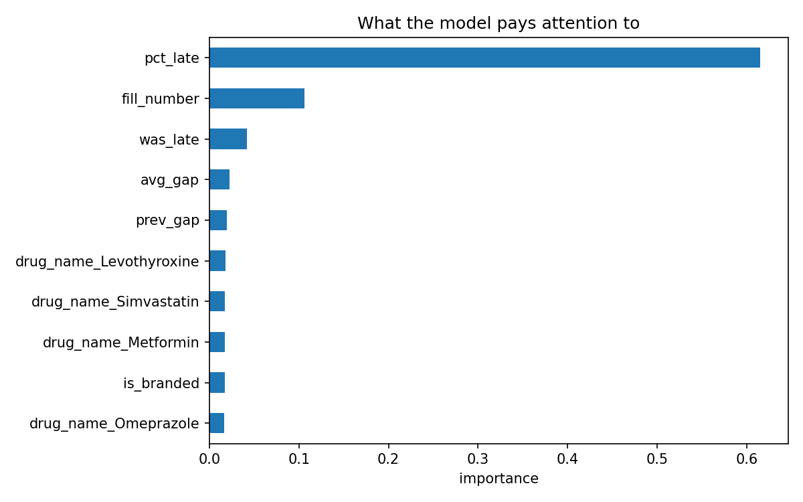

# Pharmacy Refill Risk Prediction

Two models on one pharmacy dataset, served from one API:

- **Model A — refill risk.** Will this patient pick up their next refill on time?
  So the pharmacy can call the ones who won't, before they run out.
- **Model B — demand forecast.** How many units of this drug will we dispense next week?
  So the owner knows how much to order.

Built end to end: synthetic data → exploration → feature engineering → models → REST API.

---

## Model A — the problem

A pharmacy dispenses a 30 day supply. A patient taking their medication properly comes
back in about 30 days. A patient who comes back after 60 days spent a month with no medicine.

The pharmacy wants to call those patients before it happens. With thousands of patients
they cannot call everyone, so they need to know **who** to call.

**Prediction question:** for each fill, on the day the medication runs out
(`fill_date + days_supply`), will the patient return within **14 days**?

- `1` = returned in time
- `0` = returned late, or never returned

Never returning counts as `0`, not as missing data. Those are the patients that matter most.

---

## The data

**Synthetic.** Real dispensing records are protected health information.

The field shapes mirror a production pharmacy management system — `Person`, `Patient`,
`Prescriber`, `Drug`, `Insurance`, `Prescription`, `PrescReFill`. Identifiers used
(NDC-11, NPI, DEA, DAW, BIN/PCN) are public NCPDP and FDA standards.

| File | Rows | What it holds |
|---|---:|---|
| `data/drugs.csv` | 12 | NDC, strength, form, DEA class, AWP, pack size |
| `data/insurances.csv` | 6 | BIN/PCN, brand and generic copay, cash flag |
| `data/prescribers.csv` | 60 | NPI, DEA number, specialty |
| `data/patients.csv` | 3,000 | DOB, gender, address, language, primary insurance |
| `data/prescriptions.csv` | 17,096 | Rx header — drug, qty, days, refills authorized |
| `data/fills.csv` | 105,549 | one row per pickup — the fact table |

**How the signal was planted.** Each patient is assigned a hidden `adherence` score
between 0 and 1 that drives how long they wait before returning. That score is never
written to any file. The model has to recover it from the dates alone — which makes it
possible to verify the pipeline actually works.

Prescriptions renew when refills run out, producing a new Rx number and resetting the
refill counter, the same as a real pharmacy. Verified: no row has
`refill_num > refills_authorized`.

---

## Results

Test set is every fill running out in 2026. Training set is everything before it.

| Model | Accuracy | ROC-AUC |
|---|---:|---:|
| Always guess "will return" | 0.555 | — |
| Logistic Regression | 0.657 | 0.718 |
| XGBoost | **0.671** | 0.718 |

**XGBoost beat logistic regression by 1.4 points of accuracy and not at all on AUC.**

That is a real finding, not a disappointment. `pct_late` — how often the patient has been
late before — carries 63% of the model's total feature importance, and its relationship to
the outcome is close to linear. A straight line already captures it, so trees have little
left to add.

The ceiling here is set by the data, not the algorithm. Improving it needs more
information (copay amount, auto-refill enrolment, distance to pharmacy, total medication
count), not a bigger model.

### Error breakdown, XGBoost at the 0.5 cut-off

|  | Predicted: won't return | Predicted: will return |
|---|---:|---:|
| **Actually didn't return** | 3,137 | 2,072 |
| **Actually returned** | 1,781 | 4,724 |

Precision on the at-risk class 0.64, recall 0.60.

### The cut-off is a business decision

The 0.5 threshold is a choice, not a rule. Moving it changes the whole operation:

| Cut-off | Calls made | At-risk caught | At-risk missed | Wasted calls |
|---:|---:|---:|---:|---:|
| 0.4 | 1,424 | 1,031 | 4,178 | 393 |
| 0.5 | 3,182 | 2,185 | 3,024 | 997 |
| 0.6 | 5,175 | 3,246 | 1,963 | 1,929 |
| 0.7 | 7,395 | 4,157 | 1,052 | 3,238 |
| 0.8 | 9,895 | 4,898 | 311 | 4,997 |

*(from the logistic model; the shape is the same for XGBoost)*

At 0.7 the pharmacy catches 80% of at-risk patients for about 7,400 calls. At 0.5 it makes
half the calls and catches 42%. Which is correct depends on call capacity and on how much
a missed refill costs — not on anything in the model.

---

---

## Model B — demand forecasting

A different problem shape on the same data: predict a **number**, not a yes/no, with
time as the main dimension.

**Prediction question:** for each drug on each day, how many units will be dispensed
over the **next 7 days**?

Fill events are first collapsed to one row per drug per day, on a complete calendar —
days with no dispensing become a real `0`, not a missing row. Features are lags (1, 7,
14, 28 days) plus 7 and 28 day rolling averages, all shifted so the current day is
excluded, plus day of week and month.

| Model | MAE (units) | MAPE |
|---|---:|---:|
| "next week = last week" | 307 | 19.3% |
| XGBoost regressor | **289** | 20.0% |

Average real 7-day demand is 1,597 units.

**The two metrics disagree, and that is the interesting part.** MAE counts raw units, so
high-volume drugs dominate it — the model wins there. MAPE weights every drug equally, so
the quiet drugs count as much as the busy ones, and there the model is marginally worse
than repeating last week.

For inventory ordering MAE is the right metric — you order in units, not percentages — so
the model is the better choice for the job. Reporting only the flattering one would be
the easy mistake.


Blue is real demand, orange is the forecast, on 2026 data the model never saw. It tracks
the level and deliberately does not chase the spikes: the day each patient walks in is
random by construction, so a model that matched every spike would be memorising, not
learning. The visible weakness is the first two weeks of January, where it carries
December's level forward before adjusting — an argument for scheduled retraining.

---

## Avoiding leakage

Three deliberate decisions, each one a way this project could have silently produced a
useless model that scored well:

**Time-based split.** Train on everything before 2026-01-01, test on 2026. A random split
would let the model train on March and be tested on February.

**Expanding-window features.** `avg_gap` and `pct_late` use `.expanding().mean()`, so each
row sees only its own past. A plain `.mean()` over each group would leak future rows into
past ones.

**Censoring.** Any fill whose run-out date falls in the final 14 days of the data is
dropped — 3,603 rows. Those patients still had time to return; the pipeline had marked
them `0` because no next row existed. Keeping them would teach the model that recent
prescriptions never get refilled.

Model B has the same three in different clothing: a date split, `.shift(1)` before every
rolling average so the current day never enters its own feature, and `dropna()` to remove
the head of the series (no history yet) and the tail (no future yet).

---

## Feature importance



| Feature | Importance |
|---|---:|
| `pct_late` | 0.627 |
| `fill_number` | 0.103 |
| `was_late` | 0.041 |
| `avg_gap` | 0.021 |
| `prev_gap` | 0.019 |

`pct_late` dominating is the confirmation that the pipeline is correct end to end — it is
the visible trace of the hidden adherence score from the data generator.

This also matters operationally. In healthcare "the model said so" is not an acceptable
answer. "This patient has been late on 8 of their last 10 refills" is one a pharmacist
can check and disagree with.

---

## Running it

```bash
python -m venv .venv
.venv\Scripts\activate          # Windows
pip install -r requirements.txt

python 01_generate_data.py         # writes data/
python 02_explore.py               # writes reports/eda.png
python 03_build_training_table.py  # writes data/training_table.csv
python 04_train_model.py           # baseline + threshold analysis
python 05_better_model.py          # XGBoost + feature importance
python 06_forecast_demand.py       # demand forecast + reports/forecast.png

uvicorn app:app --reload           # http://127.0.0.1:8000/docs
```

### API

`GET /health` — liveness check.

`POST /predict` — Model A. Is this patient going to miss their refill?

```json
{
  "patient_age": 71, "drug_name": "Metformin", "is_branded": false,
  "supply_days": 90, "fill_number": 9, "prev_gap": 92,
  "was_late": 0, "avg_gap": 91, "pct_late": 0.05
}
```

```json
{ "refill_probability": 0.781, "risk": "low", "action": "no action" }
```

Change `pct_late` to `0.85`, `prev_gap` to `150`, `was_late` to `1`:

```json
{ "refill_probability": 0.178, "risk": "high", "action": "pharmacist call" }
```

The endpoint returns a risk band and an action, not a bare probability — a pharmacy can
act on "pharmacist call", not on `0.178`. The band cut-offs come from the trade-off table
above.

`POST /forecast` — Model B. How much of this drug should I order?

```json
{
  "drug_id": 1,
  "as_of": "2026-06-01",
  "daily_units": [180, 90, 180, 90, 540, 270, 360, 450, 180, 270,
                  360, 450, 270, 270, 360, 450, 450, 90, 270, 720,
                  540, 180, 90, 270, 360, 90, 270, 90, 0]
}
```

```json
{ "forecast_next_7_days": 2136, "suggested_order": 2350 }
```

*(actual demand that week was 1,800 units)*

The caller sends 29 raw daily totals — today plus 28 days of history — not engineered
features. Asking a pharmacy system to compute `roll28` correctly would push feature
engineering across a network boundary, where it would drift out of sync with training
the first time either side changed. The endpoint derives the features itself, from the
same code path the model was trained on.

The saved model bundle stores the trained model **and** the exact column order it was
trained on. One-hot encoding a single incoming patient produces one drug column where the
model expects twelve; `reindex` against that stored order fills the rest. Without it the
model reads the wrong value from the wrong column and returns confident nonsense with no
error.

---

## Files

```
01_generate_data.py          synthetic pharmacy data -> 6 CSVs
02_explore.py                EDA: is this problem solvable at all?
03_build_training_table.py   label + leak-free features -> training_table.csv
04_train_model.py            logistic baseline, error analysis, threshold trade-off
05_better_model.py           XGBoost, model comparison, feature importance
06_forecast_demand.py        Model B: daily series, lag features, demand forecast
app.py                       FastAPI service - /predict and /forecast
```

`data/`, `models/` and `reports/` are gitignored — every one of them is rebuilt by
running the scripts in order.

---

## What I'd do next

- **Calibration.** Check whether a predicted 0.7 really does return 70% of the time.
  A probability that drives a phone-call budget should be calibrated, not just ranked well.
- **More features.** Copay amount, auto-refill enrolment, distance to pharmacy, total
  active medication count. The 1.4-point gap between models says the limit is information,
  not algorithm.
- **Drift monitoring.** Track feature distributions against training. Note that
  `fill_number` drifts upward by construction as time passes, so it needs excluding from
  any naive alert.
- **Scheduled retraining** with the run and its metrics recorded per model version.

---

*Portfolio project. The data is synthetic and generated by `01_generate_data.py`;
it is not from any production system.*
